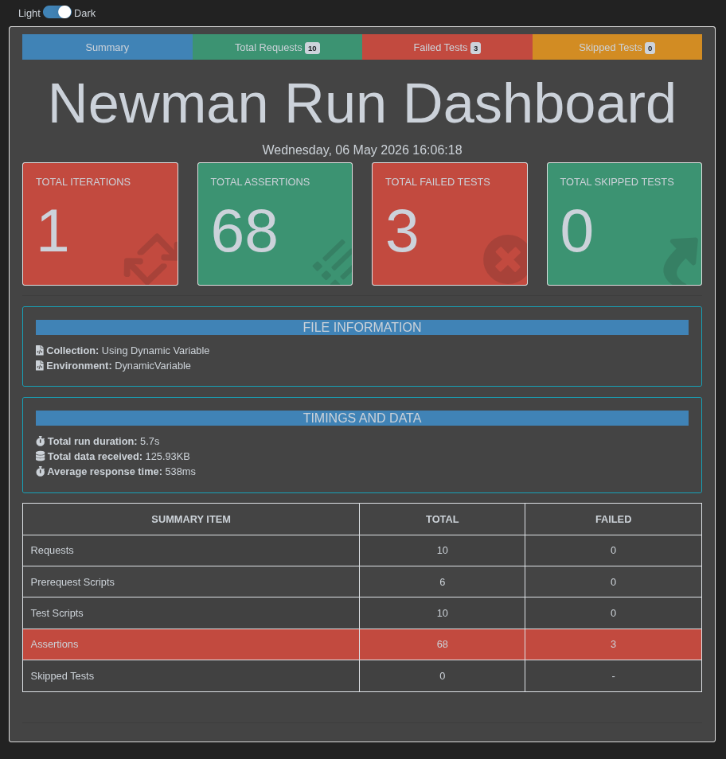

# 🏨 API Testing for Restful Booker


---

# 📌 Project Overview

This repository contains a complete **API Test Automation Framework** developed for the **Restful Booker API** using:

- Postman
- Newman
- JavaScript
- CSV Data Driven Testing
- Dynamic Variables
- Automated Assertions

The project demonstrates real-world API testing workflows including:

✅ CRUD API Testing  
✅ Dynamic Variable Handling  
✅ Data Driven Testing (CSV Based)  
✅ API Chaining  
✅ Authentication Testing  
✅ Response Validation  
✅ Automated Assertions  
✅ Negative Testing  
✅ Newman CLI Execution  
✅ HTML Report Generation  

---

# 🔗 Repository Link

👉 Repository:  
https://github.com/mostafizur-zahid/API-Testing-for-Restful-Booker

---

# 🧪 Technologies Used

| Technology | Purpose |
|---|---|
| Postman | API Testing |
| Newman | Command Line Automation |
| JavaScript | Test Scripting |
| CSV File | Data Driven Testing |
| Moment.js | Dynamic Date Handling |

---

# 📂 Project Structure

```bash
API-Testing-for-Restful-Booker/
│
├── 01. Using Dynamic Variable/
│   ├── Using Dynamic Variable.postman_collection.json
│   ├── DynamicVariable.postman_environment.json
│   ├── Newman Summary Report.pdf
│   └── Newman HTML Report
│
├── 02. Using Data Driven Method/
│   ├── Using CSV Data Driven Method.postman_collection.json
│   ├── DataDriven.postman_environment.json
│   ├── DDT_CreateID - Sheet1.csv
│   └── DDT_Update - Sheet1.csv
│
└── README.md
```

---

# 🚀 Project Modules

# 1️⃣ Dynamic Variable Based Testing

This module performs automated API testing using dynamically generated runtime data.

## ✨ Features

- Random first name generation
- Random last name generation
- Random integer generation
- Random boolean generation
- Dynamic check-in/check-out date creation
- Automatic environment variable storage

## 🔥 Example

```javascript
var fName = pm.variables.replaceIn('{{$randomFirstName}}');
pm.environment.set("firstname", fName);
```

Dynamic dates generated using:

```javascript
var cIn = require('moment')().format('YYYY-MM-DD');
```

---

# 2️⃣ CSV Based Data Driven Testing (DDT)

This module demonstrates **Data Driven Testing** using external CSV datasets.

Instead of hardcoding test data inside requests, data is loaded dynamically from CSV files.

## ✨ Features

✅ External test data management  
✅ Multiple dataset execution  
✅ Reusable test logic  
✅ Scalable automation structure  

---

# 📄 CSV Data Example

| firstname | lastname | totalprice | depositpaid |
|---|---|---|---|
| Zahid | Hasan | 500 | true |
| Rakib | Ahmed | 1000 | false |

---

# 🔥 CSV Data Handling Logic

```javascript
var firstname = pm.iterationData.get("firstname");
pm.environment.set("firstname", firstname);
```

This allows the same request to run multiple times with different datasets automatically.

---

# 🔄 API Workflow

The automation framework executes the following workflow sequentially:

```text
GetBookingID
    ↓
CreateBooking
    ↓
GetBooking
    ↓
CreateToken
    ↓
UpdateBooking
    ↓
GetUpdatedBooking
    ↓
DeleteBooking
    ↓
AfterDeleteChecking
```

---

# 📡 API Endpoints Tested

| Method | Endpoint | Description |
|---|---|---|
| GET | `/booking` | Retrieve booking IDs |
| POST | `/booking` | Create new booking |
| GET | `/booking/{id}` | Retrieve booking details |
| POST | `/auth` | Generate authentication token |
| PUT | `/booking/{id}` | Update booking |
| DELETE | `/booking/{id}` | Delete booking |

---

# 🔐 Authentication Testing

Authentication token is generated dynamically:

```json
{
  "username": "admin",
  "password": "password123"
}
```

Generated token stored in environment variable:

```javascript
pm.environment.set("token", responseBody.token);
```

---

# 🧠 Assertions Implemented

The framework validates:

✅ Status Code Validation  
✅ Response Time Validation  
✅ Response Size Validation  
✅ JSON Validation  
✅ Data Integrity Validation  
✅ Negative Testing Validation  

---

# 🔍 Sample Assertions

## Status Code Assertion

```javascript
pm.expect(pm.response.code).to.eql(200);
```

---

## Response Time Assertion

```javascript
pm.expect(pm.response.responseTime).to.be.below(3000);
```

---

## Response Body Assertion

```javascript
pm.expect(pm.response.text()).to.eql("Deleted");
```

---

# ❌ Negative Testing

After deleting a booking, the framework validates that the resource no longer exists.

## Example

```javascript
pm.expect(pm.response.code).to.eql(404);
pm.expect(pm.response.text()).to.eql("Not Found");
```

This confirms:
- Successful deletion
- Proper API behavior
- Correct negative scenario handling

---

# 📊 Newman Automation Report

The collection is executed using Newman CLI and generates automated reports.

## 📈 Report Summary

| Metric | Result |
|---|---|
| Total Requests | 10 |
| Total Assertions | 68 |
| Failed Assertions | 3 |
| Skipped Tests | 0 |
| Average Response Time | 538ms |

---

# 🖼️ Newman Execution Report



---


# ⚠️ Failed Assertions Analysis

The project identified several API inconsistencies:

| Scenario | Expected | Actual |
|---|---|---|
| Create Booking | 201 | 200 |
| Delete Booking | 200 | 201 |
| Delete Message | Deleted | Created |

These failures highlight:
- API response inconsistency
- Importance of assertion validation
- Real-world testing challenges

---

# ▶️ How to Run the Project

# 1️⃣ Install Newman

```bash
npm install -g newman
```

---

# 2️⃣ Run Dynamic Variable Collection

```bash
newman run "Using Dynamic Variable.postman_collection.json" \
-e "DynamicVariable.postman_environment.json"
```

---

# 3️⃣ Run Data Driven Testing Collection

```bash
newman run "Using CSV Data Driven Method.postman_collection.json" \
-e "DataDriven.postman_environment.json" \
-d "DDT_CreateID - Sheet1.csv"
```

---

# 4️⃣ Generate HTML Report

```bash
newman run collection.json \
-e environment.json \
-r htmlextra
```

---

# 📚 Learning Outcomes

This project demonstrates practical experience in:

- API Automation Testing
- Postman Scripting
- Newman CLI Execution
- Dynamic Variables
- CSV Data Driven Testing
- API Chaining
- Automated Assertions
- Authentication Testing
- Negative Testing
- Report Generation

---

# 🔥 Key Highlights

✅ Real-world API automation workflow  
✅ Dynamic runtime data generation  
✅ CSV-based scalable testing approach  
✅ Automated validation framework  
✅ Detailed assertion strategy  
✅ Negative testing implementation  
✅ Professional reporting system  

---

# 🔧 Future Improvements

- CI/CD Integration using GitHub Actions
- Dockerized Newman Execution
- Jenkins Pipeline Integration
- JSON Schema Validation
- Advanced HTML Dashboard
- Parallel Test Execution
- Environment-based Deployment Testing

---

# 👨‍💻 Author

## Md. Mostafizur Rahman Zahid

🎓 CSE Graduate  
🔐 Aspiring Security Engineer  
🧪 SQA & API Automation Enthusiast  
⚡ Cybersecurity & DevSecOps Learner  

🔗 LinkedIn:  
https://www.linkedin.com/in/mostafizur-zahid/

🔗 GitHub:  
https://github.com/mostafizur-zahid  

---

# ⭐ Conclusion

This project is designed to simulate a real-world API automation testing workflow used in modern software quality assurance environments.

It demonstrates not only API request execution, but also:
- scalable test design,
- reusable automation logic,
- data-driven execution,
- runtime validation,
- and professional reporting practices.
